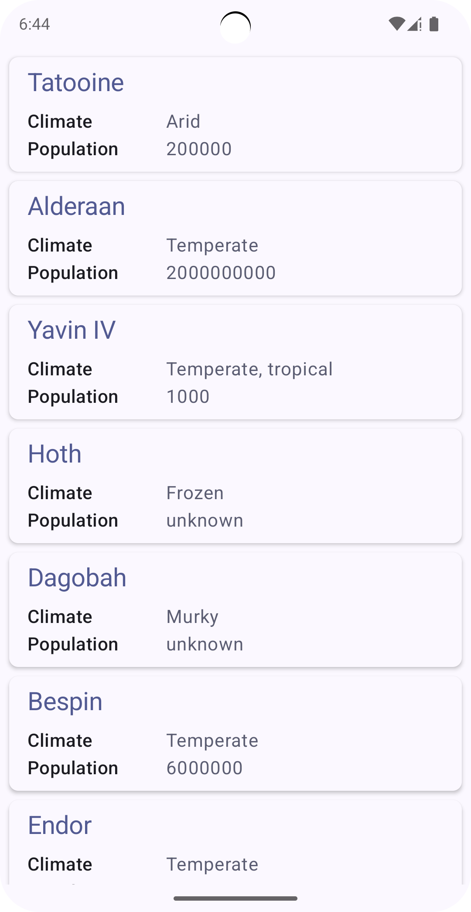
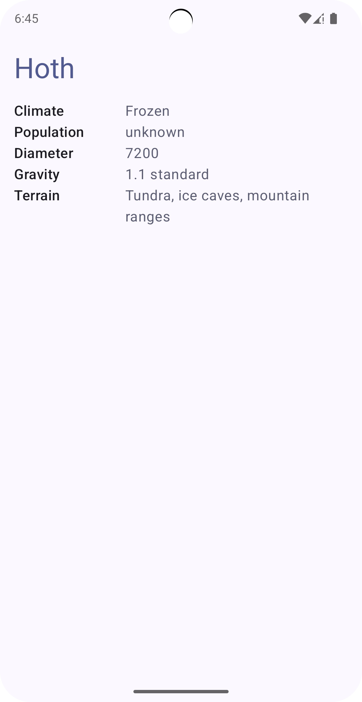

# SWPlanetViewerDemo 

Demo Android application written in Kotlin with Compose which displays a list of planets from the Star Wars API.

## Deployment

Clone, sync-build and run in Android Studio

## Screenshots

